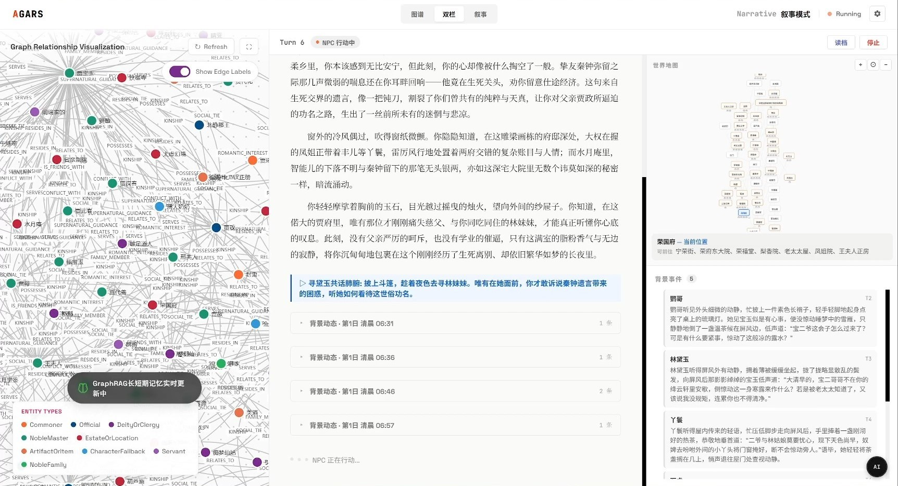
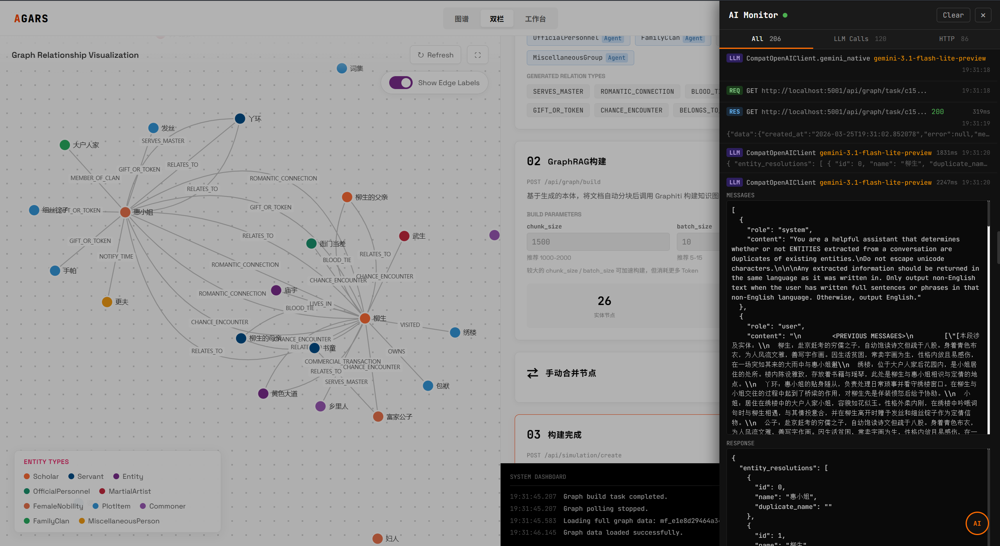
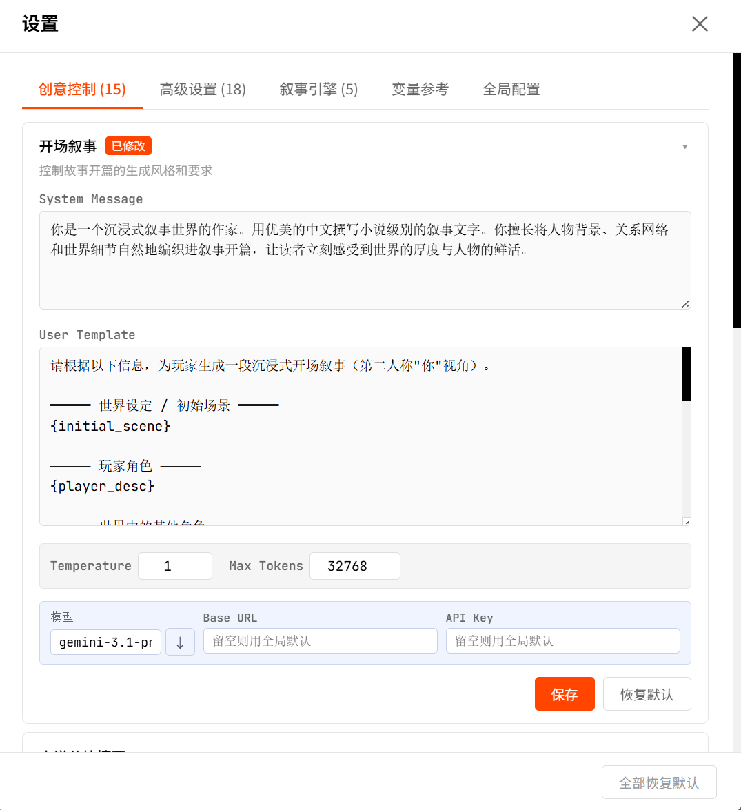
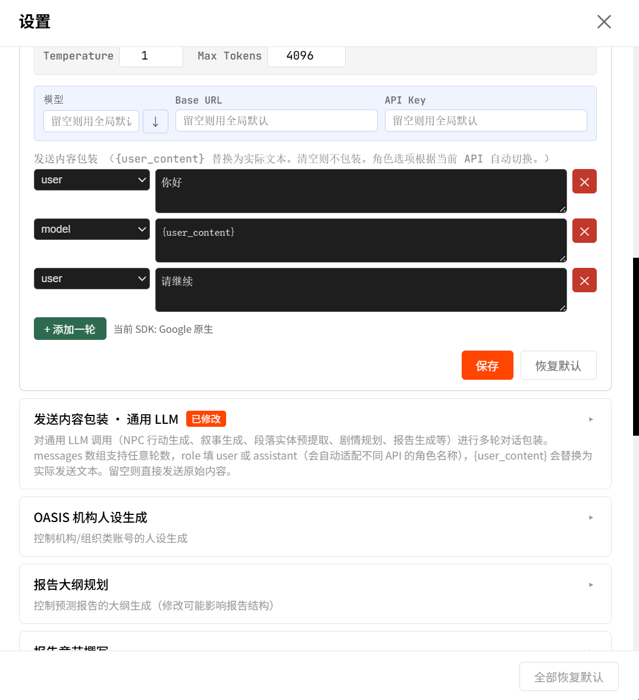
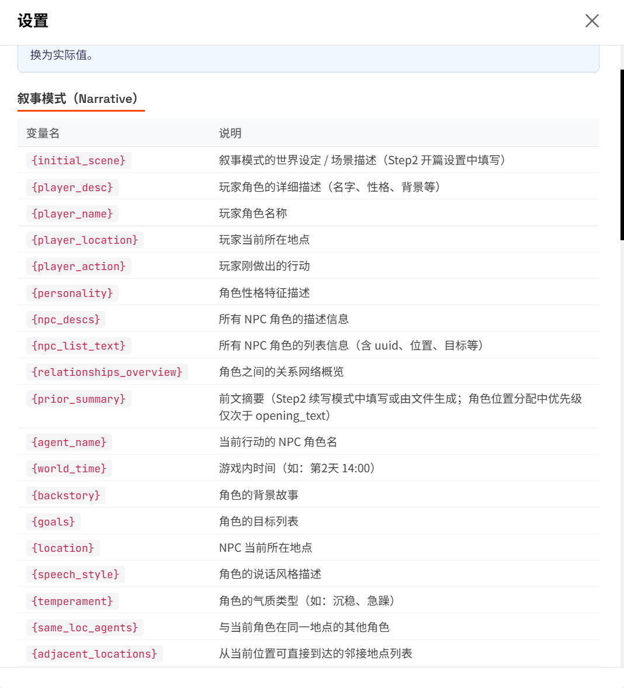

# AGARS — AI-Generated AI Roleplay Simulator

[English](./README-EN.md) | [中文文档](./README.md)

## 项目介绍

**AGARS** 是基于 [MiroFish](https://github.com/666ghj/MiroFish) 的二次开发项目，专注于 AI 驱动的角色扮演模拟。

常规 AI 角色扮演前端在单轮对话中同时处理叙事、角色扮演与世界管理，AI 推理能力被严重稀释；再靠堆叠上下文长度弥补记忆，成本高且信息易丢失。本项目将上述任务分离至独立 agent 分别执行，每次调用只做一件事，显著提升推理质量；同时以知识图谱替代暴力上下文，按需检索而非全量塞入 prompt，配合分级模型调度，实现与常规前端接近的成本。

## 演示视频
  <div align="center">
    <a href="https://www.bilibili.com/video/BV1MBXwBSEvp" target="_blank">
      
    </a>
  </div>

### 核心功能

- **任务分离架构**：叙事、角色扮演、世界管理由独立 agent 分别执行，不在单轮对话中堆叠多任务——AI 每次只做一件事，推理质量显著提升
- **知识图谱记忆**：基于 FalkorDB / Zep 的结构化记忆替代暴力堆叠上下文，角色关系与世界事实持久化存储，按需精确检索而非全量塞入 prompt
- **AI 剧本规划**：每次玩家行动后由专门的规划调用编排后续 NPC 反应、场景转换与新角色引入，实现戏剧化节奏而非机械轮转
- **动态世界建模**：地图拓扑、角色位置、物品归属全程追踪，移动经邻接图验证，世界状态在引擎层而非 prompt 层维护
- **深度 Prompt 控制**：上下文包装与文本变量调用提供高自由度的 prompt 定制能力，内置 monitor 实时查看每次调用的完整 prompt，便于调试与调优
- **成本优势**：agent 按职责分配不同模型与上下文窗口，知识图谱按需检索取代长上下文堆叠，整体成本与常规单轮对话前端接近

## 功能截图

### 叙事模式


### 知识图谱与 Monitor


### Prompt 编辑


### 消息包装


### 文本变量说明


### Monitor 历史记录


## 快速开始

### 一键安装（推荐）

双击项目根目录的 **`install.bat`**，脚本会自动检测并安装所有依赖（Node.js、Python、uv、Docker Desktop、FalkorDB），已安装的会自动跳过。

安装完成后：

```bash
npm run dev
```

打开浏览器访问 `http://localhost:5173`，在右上角**设置 → 全局配置**中填写 API Key 即可开始使用。

### 手动安装

如果一键安装脚本不适用（如 Linux / macOS），可按以下步骤操作：

#### 前置要求

| 工具 | 版本要求 | 说明 |
|------|---------|------|
| **Node.js** | >= 18 | 前端运行环境（[下载](https://nodejs.org/)） |
| **Python** | >= 3.11 | 后端运行环境（[下载](https://www.python.org/)） |
| **uv** | 最新版 | Python 包管理器（[安装](https://docs.astral.sh/uv/)） |
| **Docker** | 最新版 | 用于运行 FalkorDB（[下载](https://www.docker.com/products/docker-desktop/)） |

LLM API 需兼容 OpenAI SDK 格式，并支持 `response_format` 的 `json_schema` 模式（结构化输出）。

#### 1. 启动 FalkorDB

```bash
docker run -d --name falkordb -p 6379:6379 falkordb/falkordb
```

#### 2. 安装依赖

```bash
# 一键安装所有依赖（Node + Python）
npm run setup:all
```

#### 3. 启动服务

```bash
npm run dev
```

- 前端：`http://localhost:5173`
- 后端 API：`http://localhost:5001`

#### 4. 配置 API Key

首次启动时 `.env` 会从 `.env.example` 自动生成。打开设置页面的**全局配置**标签页填写 API Key，或手动编辑 `.env` 文件：

| 变量 | 必需 | 说明 |
|------|------|------|
| `LLM_API_KEY` | 是 | LLM API 密钥 |
| `LLM_BASE_URL` | 是 | LLM API 地址（OpenAI SDK 格式） |
| `LLM_MODEL_NAME` | 是 | 模型名称 |
| `ZEP_API_KEY` | 是 | Zep Cloud API 密钥（[免费注册](https://app.getzep.com/)） |
| `EMBEDDING_API_KEY` | 是 | Embedding 模型密钥，需支持 `/embeddings` 接口 |
| `EMBEDDING_BASE_URL` | 是 | Embedding API 地址 |
| `EMBEDDING_MODEL_NAME` | 是 | Embedding 模型名称（推荐 `text-embedding-3-small`） |
| `FALKORDB_HOST` | 否 | FalkorDB 地址（默认 `localhost`） |
| `FALKORDB_PORT` | 否 | FalkorDB 端口（默认 `6379`） |
| `FALKORDB_PASSWORD` | 否 | FalkorDB 密码（默认为空） |

### Docker 部署

也可以使用 Docker Compose 一键部署：

```bash
docker compose up -d
```

## 致谢

本项目基于以下开源项目构建，感谢这些项目的贡献：

- **[MiroFish](https://github.com/666ghj/MiroFish)** — 群体智能预测引擎，本项目的基础框架
- **[OASIS](https://github.com/camel-ai/oasis)** / **[CAMEL-AI](https://github.com/camel-ai/camel)** — 多智能体社交模拟框架
- **[Graphiti](https://github.com/getzep/graphiti)** — 知识图谱构建引擎
- **[Zep](https://github.com/getzep/zep)** — 智能体长期记忆服务
- **[FalkorDB](https://github.com/FalkorDB/FalkorDB)** — 高性能图数据库
- **[D3.js](https://github.com/d3/d3)** — 数据可视化库

## 许可证

本项目基于 [AGPL-3.0](./LICENSE) 许可证开源。
